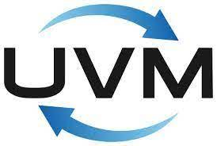

        <samp> Hi, I am currrently working as FPGA R&D Engineer at Tejas Networks, Bangalore.  
               I am keenly interested in frontend flow of VLSI design.
        </samp>

## Tech Stack:

  
  
  
  
  
  
  
  
  
  
    

      
## Contact:
<a target="_blank" href="https://www.linkedin.com/in/vinaykhochare/"></img></a>
